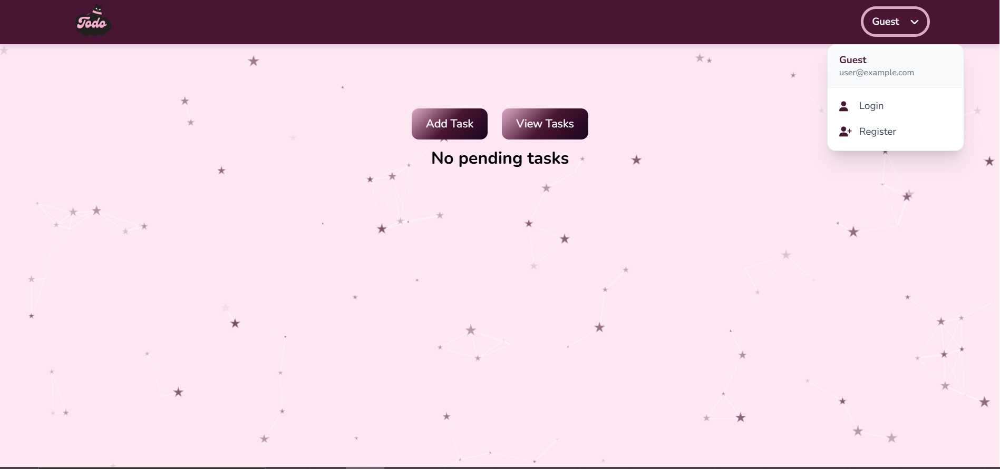
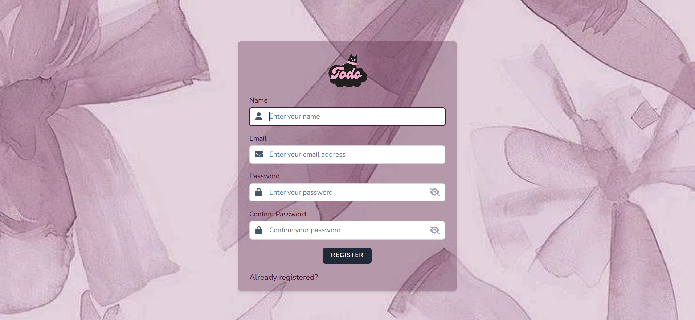
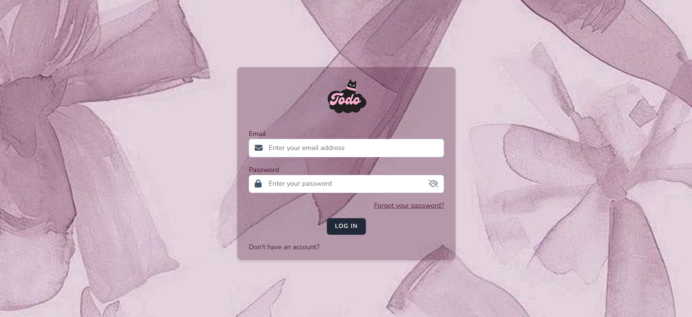
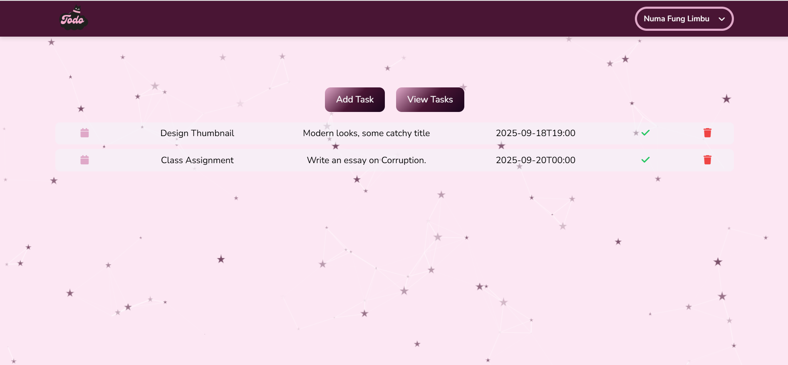
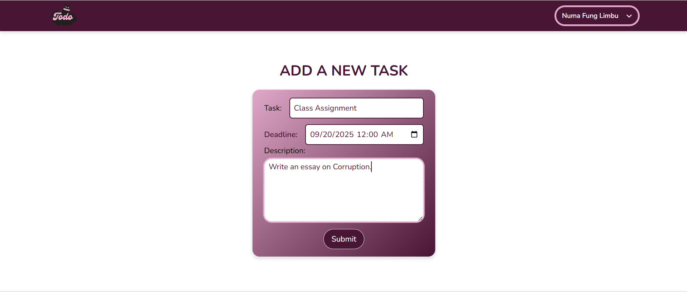
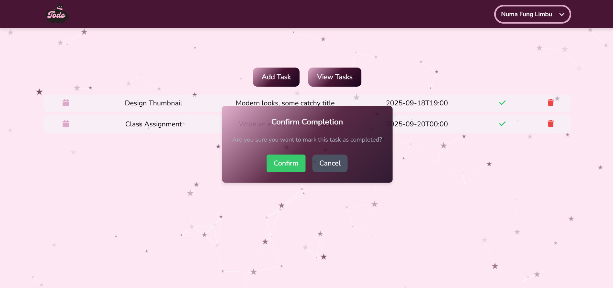
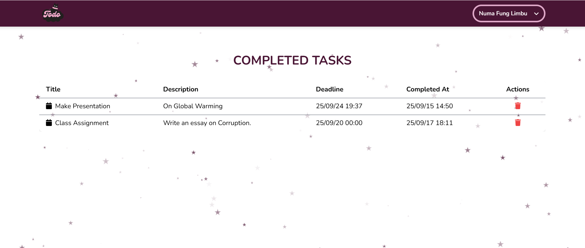

# To-Do List

   

## Overview
**To-Do List** is a simple and intuitive task management application designed to help users organize, track, and complete their daily tasks efficiently. Whether you're managing personal errands, work projects, or collaborative goals, this application provides a streamlined interface to stay productive.

Something every developer has made in some point of their career.

## 📋 Table of Content
- **Technology Used**
- **Installation**
- **Preview**
- **Contributing**
- **License**


## 🛠️ Technologies Used
- **Frontend**: HTML, [Tailwind CSS](https://tailwindcss.com/), [Tailwind](https://tailwindcss.com/), [Alpine.js](https://alpinejs.dev/), [Axios](https://axios-http.com/)
- **Backend**: [Laravel 11.31](https://laravel.com/), PHP 8.2
- **Database**: MySQL (configurable via `.env`)
- **Tools**: [Laravel Vite](https://laravel.com/docs/vite), [Laravel Breeze](https://laravel.com/docs/starter-kits),[FontAwesome](https://fontawesome.com/)
- **Version Control**: Git with GitHub for collaborative development 


## 🔧 Installation
To set up **To-Do** locally, follow these steps:

1. **Clone the Repository**:
   ```bash
   git clone https://github.com/sonuma21/Todo-list.git
   cd Todo-list
2. **Install Dependencies:**
    ```bash
    composer install
    npm install
3. **Set Up Environment:**
    ```bash
    cp .env.example .env
4. **Run the Application:**
    ```bash
    php artisan serve


- **🏠 Preview :**









## 🤝 Contributing
Pull requests are welcome.

For major changes, please open an issue first to discuss what you would like to change.

## 📜 License
This project is licensed under the MIT License.
